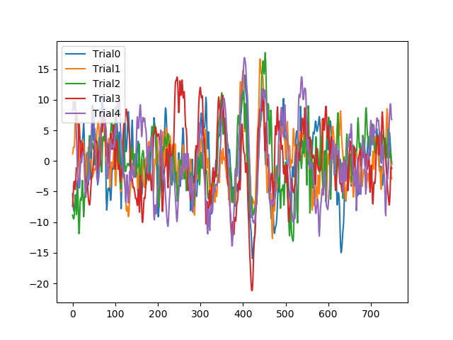
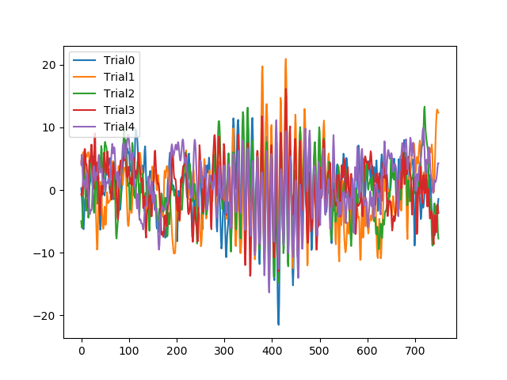
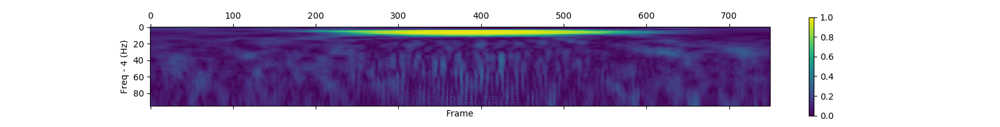
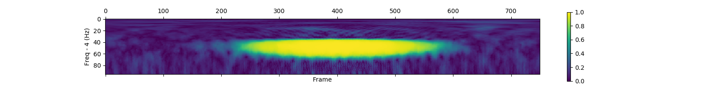
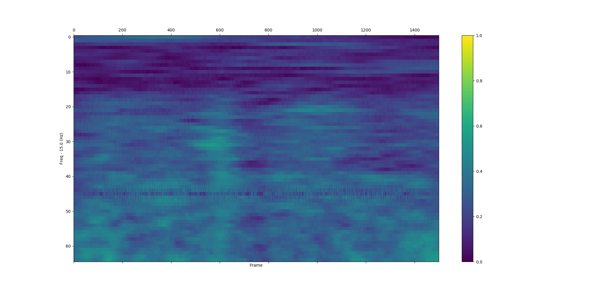
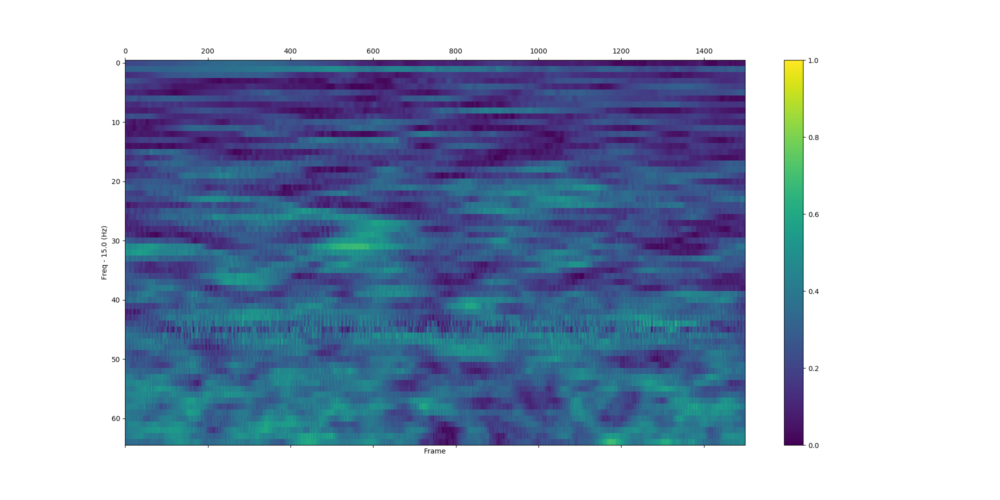
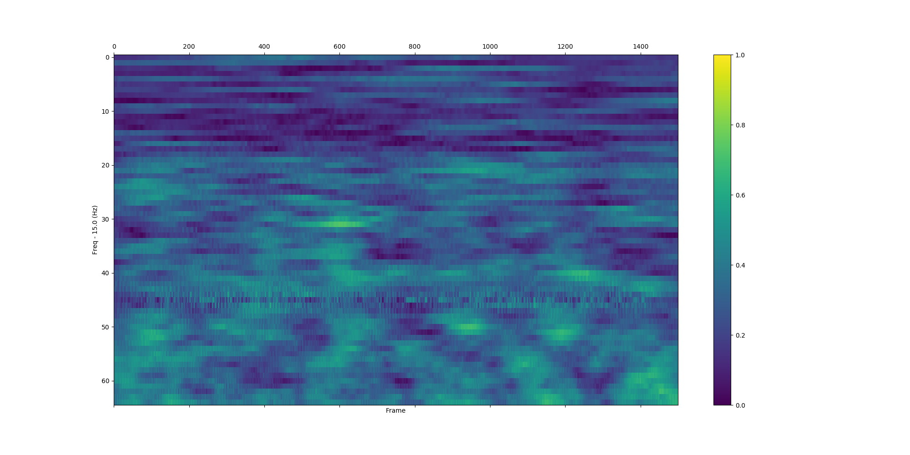

# pyplfv

Python package to process EEG data from BrainVision's 'Analyzer' and 'Recorder'.
Still in development and not packaged.  
I will develop testings on next update.  

### Dependency
- numpy
- pandas
- scipy
- matplotlib

## Usages

### Load matfile
```Python

from data_structures import EEGData

eeg_data = EEGData('./SampleData/sample.mat')

print(eeg_data.channel_names)
print(eeg_data.properties)
print(eeg_data.markers)
print(eeg_data.signals)
```

### Phase-locking factor (PLF)

Calculate Phase locking factor and nonparametric testing.  
Referenced
```
Oscillatory gamma-band (30-70 Hz) activity induced by a visual search task in humans (Tallon et al. 1997)
```
Please see the document if you want more details.  
<br>
There is an information about 'sig_name' in Appendix.  
'trial_marker' is a marker you decided to represent the start of the trials.  
show_plf_spectgram returns plf matrix which is type of numpy.array.


```Python

from plf import show_plf_spectgram
#def show_plf_spectgram(eeg_data, sig_name, trial_marker, farray, offset, length, save=False, filename='plf.png')
plfs = show_plf_spectgram(eeg_data, 'Cz', 'S255', [1.0 * i for i in range(20,101)], -500, 1500, True, 'Images/plf.png')

```

Other example,

```Python
matdata = sio.loadmat('SampleData/siulation_50Hz.mat')
trial_num = len(matdata['seg'][0])
arr = np.array(matdata['seg'], dtype='float128').T
sig = np.hstack([arr[i] for i in range(trial_num)])
time_interval = 0.002
farray = [1.0 * i for i in range(4,100)]
start_time_of_trials = [750 * i for i in range(trial_num)]
length_before_start = 0
length_after_start = 1.5

_plf = plf_with_farray(sig,
                      time_interval,
                      farray,
                      start_time_of_trials,
                      length_before_start,
                      length_after_start)
plt.matshow(_plf, vmin=0, vmax=1.0)
#plt.matshow(ave)
plt.colorbar()
plt.xlabel('Frame')
plt.ylabel('Freq - 4 (Hz)')
plt.savefig('./Images/plf_simulation2.png')
plt.show()

```

<br>

| Pseudo random added 10Hz gaussian | Pseudo random added 50Hz gaussian |  
|-----------------------------------|-----------------------------------|
|   |  |
|  </img></img>   |  </img></img>   |

<br>

If you want more samples, please see 'plf_samples.py'.

### Phase-locking Value (PLV)

Calculate Phase locking value and statistical test based on surrogate data.  
Referenced
```
Measuring Phase Synchrony in Brain Signals (Lachaux et al. 1997)
```
Please see the document if you want more details.  
<br>

plv_bet_2ch returns plv matrix which is type of numpy.array.  
When you want to get the plv about each situations, you can add parameters 'trial_filering' and 'trial_filter'.  
If only you need is plv matrix, you can hide the heatmap by make show_mat=False.  

```Python

from plv import plv_bet_2ch
eeg_data = EEGData('./SampleData/sample.mat')
#def plv_bet_2ch(eeg_data, sig_name1, sig_name2, trial_marker, farray, offset, length, trial_filering=False, trial_filter=[], show_mat=False):
plvs = plv_bet_2ch(eeg_data, 'Pz', 'Cz', 'S255', np.arange(15.0, 80.0, 1.0), int(-1.0 / 0.002), int(3 / 0.002))

```

or

```Python

situation_0 = [1, 4, 8, 13, 15, 21, 23, 25, 26, 30, 31, 32, 38, 40, 44, 47, 52, 59, 62, 64, 65, 82, 85, 89, 92, 99, 105, 107, 112, 114, 117, 133, 138, 144, 145, 146, 147, 149]
situation_7 = [0, 9, 11, 12, 14, 27, 29, 33, 36, 39, 43, 46, 53, 56, 60, 61, 63, 71, 74, 75, 81, 90, 93, 96, 104, 106, 108, 109, 113, 116, 118, 120, 124, 126, 127, 129, 132, 135, 136, 140, 142, 148]

plv_bet_2ch(eeg_data, 'Pz', 'Cz', 'S255', np.arange(15.0, 80.0, 1.0), int(-1.0 / 0.002), int(3 / 0.002), True, situation_0, True)
plv_bet_2ch(eeg_data, 'Pz', 'Cz', 'S255', np.arange(15.0, 80.0, 1.0), int(-1.0 / 0.002), int(3 / 0.002), True, situation_7, True)

```

<br>

| All trials | Situation_0 | Situation_7 |  
|------------|-------------|-------------|
|   |  |  |


<br>

## Appendix

### The structure of mat_data from 'Analyzer'

MatData has these columns.
Details are written below.

- 'Analyzer' : Analyze information on BrainVision's 'Analyzer'
- 'EEGData' : RealData
- 'EEGPoints' : Number of points
- 'EEGPosition' : ?
- 'FileName' : filename
- 'Markers' : markers which are inserted offline and online
- 'NodeName' : Node name in BrainVision's 'Analyzer'
- 'Properties' : Recording properties


### Channels

```
'Fp1', 'Fp2', 'F3', 'F4', 'C3', 'C4', 'P3', 'P4', 'O1', 'O2', 'F7', 'F8', 'T7', 'T8', 'P7', 'P8', 'Fz', 'Cz', 'Pz', 'FC1', 'FC2', 'CP1', 'CP2', 'FC5', 'FC6', 'CP5', 'CP6', 'FCz', 'HEOGL', 'HEOGR', 'VEOGU', 'VEOGL'
```

### Markers

Marker which are inserted offline and online.  
In my case, output to recorder 'S255' to represent starts of trials.  
And 'Bad Min-Max' markers are inserted by Analyzer.  
